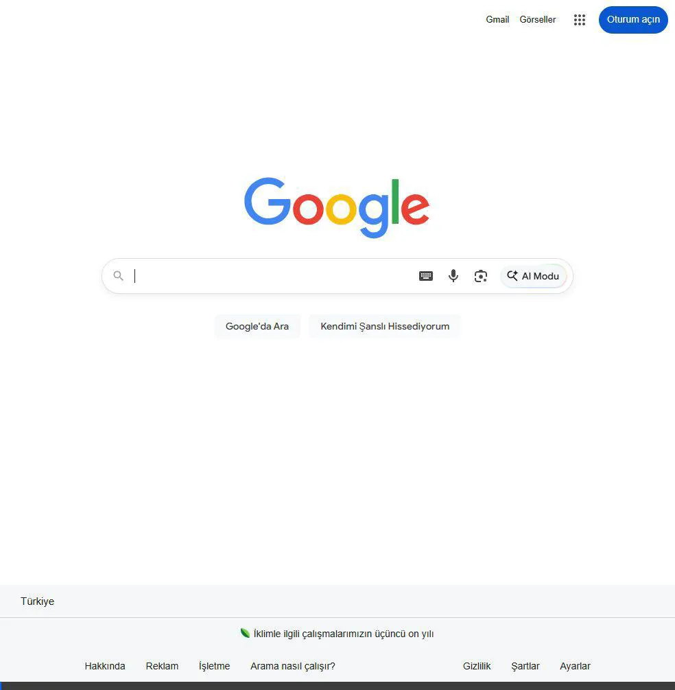

# 🛡️ TECTAK - Teknoloji Etkinlik Takvimi

Türkiye'deki teknoloji, savunma sanayii, robotik ve bilişim dünyasından en güncel etkinliklerin, fuarların ve yarışmaların merkezi takip platformu.



## 🚀 Özellikler

-   **🎯 Kapsamlı Veritabanı:** Türkiye genelindeki tüm büyük teknoloji ve savunma sanayii fuarlarını (TEKNOFEST, SAHA EXPO, IDEF, WIN EURASIA vb.) tek bir yerden takip edin.
-   **🛡️ Savunma Sanayii Entegrasyonu:** Savunma sanayii etkinlikleri için özel kategori ve detaylı takip.
-   **📍 İnteraktif Harita:** Etkinlikleri Türkiye haritası üzerinde konumlarına göre keşfedin. Heatmap veya pin modları arasında geçiş yapın.
-   **🟢 Başvuru Durum Yönetimi:** "Başvuruları Açık" ve "Başvuruları Kapanan" etkinlikleri anında ayırt edin.
-   **🔍 Gelişmiş Filtreleme:** Arama, kategori ve Ücretli/Ücretsiz filtreleme seçenekleriyle aradığınız etkinliğe saniyeler içinde ulaşın.
-   **⏳ Canlı Geri Sayım:** Verilerin bir sonraki otomatik güncellenme zamanını canlı sayaçla takip edin.
-   **🤖 GitHub Actions Otomasyonu:** Her hafta otomatik olarak verileri yenileyen arka plan robotu.

## 🛠️ Teknoloji Yığını

-   **Core:** HTML5, CSS3 (Vanilla), JavaScript (ES6+)
-   **Harita:** Leaflet.js & Carto Maps
-   **Otomasyon:** GitHub Actions (Weekly Cron Job)
-   **Tasarım:** Modern Glassmorphism & Dark Mode Aesthetic

## 📦 Kurulum ve Kullanım

Projeyi yerel bilgisayarınızda çalıştırmak için:

1.  Repoyu klonlayın:
    ```bash
    git clone https://github.com/kullaniciadi/tectak.git
    ```
2.  Klasöre gidin:
    ```bash
    cd tectak
    ```
3.  `index.html` dosyasını tarayıcınızda açın.

## 🔄 Otomatik Güncelleme

Proje içerisinde yer alan `.github/workflows/update_events.yml` dosyası, GitHub üzerinden yayına aldığınızda her hafta Pazartesi günü verileri otomatik olarak `fetch_events.js` üzerinden günceller.

## 🤝 Katkıda Bulunma

1.  Bu projeyi çatallayın (Fork)
2.  Yeni bir özellik dalı oluşturun (`git checkout -b feature/yeniozellik`)
3.  Değişikliklerinizi kaydedin (`git commit -am 'Yeni özellik eklendi'`)
4.  Dala gönderin (`git push origin feature/yeniozellik`)
5.  Bir Çekme İsteği (Pull Request) oluşturun

---
*Bu proje Teknoloji meraklıları için özenle tasarlanmıştır.* 🚀
