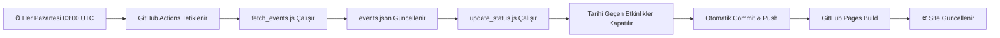
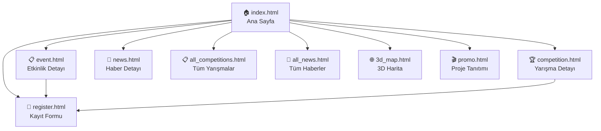

<p align="center">
  
</p>

<h1 align="center">🚀 TECTAK — Teknoloji Takvimi</h1>

<p align="center">
  <strong>Türkiye'nin Tek Merkezi Teknoloji Etkinlik Platformu</strong><br>
  <em>Seminerler · Fuarlar · Yarışmalar · Gösteriler · Haberler</em>
</p>

<p align="center">
  <a href="https://abdullahglr.github.io/tectak/">
    
  </a>
  <a href="https://github.com/abdullahglr/tectak">
    
  </a>
  <a href="https://www.linkedin.com/in/abdullah-g%C3%BCler-2a926b29b/">
    
  </a>
</p>

<p align="center">
  
  
  
  
  
  
  
  
</p>

---

## 📖 Proje Hakkında

**TECTAK** (Teknoloji Takvimi), Türkiye'deki teknoloji, savunma sanayii, robotik, yapay zeka ve bilişim dünyasından tüm etkinlikleri, yarışmaları ve haberleri **tek bir platformda** toplayan, tamamen Türkçe, açık kaynaklı bir web uygulamasıdır.

### 🎯 Çözdüğü Problem

Türkiye'de her yıl yüzlerce teknoloji etkinliği, fuar, seminer ve yarışma düzenlenmektedir. Ancak bu etkinliklerin bilgileri onlarca farklı web sitesine, sosyal medya hesabına ve haber portalına dağınık haldedir. TECTAK, bu dağınıklığı ortadan kaldırarak:

- 📍 **Nerede?** — İnteraktif harita üzerinde etkinlik konumlarını gösterir
- 📅 **Ne zaman?** — Aylık takvim görünümü ile tarihleri takip ettirir
- 💰 **Ne kadar?** — Ücretsiz/ücretli filtreleme sunar
- 🏆 **Hangi yarışmalar?** — Ulusal yarışmaları listeler ve son başvuru tarihlerini gösterir
- 📰 **Ne oldu?** — Güncel teknoloji haberlerini takip eder
- 🤖 **Yardım?** — AI asistanı ile doğal dilde soru sorma imkânı sağlar

---

## ✨ Özellikler

### 🎯 Etkinlik Yönetimi
| Özellik | Açıklama |
|---------|----------|
| **Kapsamlı Veritabanı** | 21+ etkinlik, 8 şehir, 5 kategori |
| **Gelişmiş Filtreleme** | Metin arama, kategori, şehir ve fiyat filtreleri |
| **Kategori Sistemi** | Savunma, Yazılım, Robotik, Elektronik, Yapay Zeka |
| **Canlı Durum Takibi** | Başvuruları açık/kapalı durum göstergesi |
| **Detay Sayfaları** | Her etkinlik için ayrı detay sayfası |
| **Kayıt Yönlendirme** | Doğrudan başvuru/kayıt linklerine yönlendirme |

### 🏆 Yarışma Takibi
| Özellik | Açıklama |
|---------|----------|
| **8+ Ulusal Yarışma** | TEKNOFEST, TÜBİTAK, hackathon'lar |
| **Son Başvuru Sayacı** | Deadline takibi |
| **Takım Bilgileri** | Takım büyüklüğü, ödül miktarı |
| **Etiket Sistemi** | Kategorize edilmiş yarışma etiketleri |

### 📍 İnteraktif Harita Sistemi
| Mod | Teknoloji | Açıklama |
|-----|-----------|----------|
| **📌 Pin Modu** | Leaflet.js | Etkinlik konumlarını pin olarak gösterir |
| **🔥 Isı Haritası** | leaflet.heat | Etkinlik yoğunluğunu renk gradyanı ile gösterir |
| **🌐 3D Harita** | MapLibre GL JS | Tam ekran 3D interaktif küre haritası |
| **🏗️ 3D Bina** | CSS 3D + Leaflet | 3D bina marker'ları ile derinlik efekti |

### 📅 İnteraktif Takvim
- Aylık ızgara görünümü
- İleri/geri navigasyon
- Günlere tıklayarak etkinlik detaylarını görme
- Etkinlikli günlerin renkli işaretlenmesi

### 📰 Canlı Teknoloji Haberleri
- 10+ güncel haber makalesi
- Blog formatında detaylı içerik
- Sosyal medya paylaşım butonları (Twitter, LinkedIn, WhatsApp)
- 2 saatlik otomatik güncelleme sayacı
- Son güncelleme tarihi göstergesi

### 📊 İstatistik Dashboard'u
Chart.js ile görselleştirilmiş 4 farklı analiz:
- 🍩 **Kategori Dağılımı** — Doughnut grafiği
- 📊 **Şehir Yoğunluğu** — Bar grafiği
- 🥧 **Fiyat Dağılımı** — Pie grafiği
- 📈 **Genel Özet** — Animasyonlu istatistik kartları

### 🤖 TECTAK AI Asistanı
- Doğal dil ile soru sorma
- Etkinlik arama ve filtreleme komutları
- Yarışma bilgi sorgulama
- Haber arama
- Şehir ve tarih bazlı filtreleme
- Akıllı öneri sistemi
- Chat baloncuğu arayüzü

### 🎨 3D Görsel Deneyim
| Öğe | Teknoloji | Açıklama |
|-----|-----------|----------|
| **Liquid Ocean** | Three.js + GLSL Shaders | Vertex/fragment shader ile 3D dalga animasyonu |
| **Particle Globe** | Three.js | İnteraktif parçacık küre, scroll ile döndürme |
| **Dark Overlay** | CSS | %50 opaklık siyah katman |
| **Glassmorphism** | CSS | Yarı-saydam cam efekti paneller |

### 📱 Mobil Uyumluluk
- Tam responsive tasarım
- Mobil alt navigasyon çubuğu
- Touch-optimized kontroller
- Mobil için optimize edilmiş 3D widget boyutları

---

## 🛠️ Teknoloji Altyapısı

### Frontend Mimarisi

```
TECTAK/
├── index.html              # Ana sayfa (tüm bölümler)
├── event.html              # Etkinlik detay sayfası
├── competition.html        # Yarışma detay sayfası
├── all_competitions.html   # Tüm yarışmalar listesi
├── all_news.html           # Tüm haberler listesi
├── news.html               # Haber detay sayfası
├── register.html           # Kayıt/başvuru formu
├── 3d_map.html             # 3D MapLibre harita
├── promo.html              # Proje tanıtım sunumu
├── test.html               # 3D deneyimi & yarışmalar
│
├── style.css               # Ana stil dosyası (1469 satır, 44KB)
├── app.js                  # Ana uygulama mantığı (34KB)
├── ai_assistant.js         # AI chatbot motoru (13KB)
├── liquid_ocean.js         # Three.js 3D arka plan (5.3KB)
├── dashboard.js            # Chart.js grafikleri (8.9KB)
├── detail.js               # Etkinlik detay mantığı (13.6KB)
├── comp_detail.js          # Yarışma detay mantığı (4.7KB)
├── news_detail.js          # Haber detay mantığı (3.5KB)
│
├── data.js                 # Etkinlik + yarışma verileri (18KB)
├── events.json             # Etkinlik verileri (JSON)
├── news_data.js            # Haber verileri (7.7KB)
│
├── fetch_events.js         # Veri çekme betiği
├── update_status.js        # Durum güncelleme betiği
│
├── grafikbirleşenleri/
│   └── LOGO.png            # TECTAK logosu
│
└── .github/workflows/
    └── update_events.yml   # GitHub Actions cron job
```

### Kullanılan Teknolojiler

| Katman | Teknoloji | Kullanım Alanı |
|--------|-----------|----------------|
| **Yapı** | HTML5 | Semantik sayfa yapısı |
| **Stil** | CSS3 (Vanilla) | Glassmorphism, animasyonlar, responsive layout |
| **Mantık** | JavaScript (ES6+) | Uygulama mantığı, filtreleme, DOM manipülasyonu |
| **3D Grafik** | Three.js r128 | Liquid Ocean arka plan, particle globe |
| **Shader** | GLSL | Vertex/fragment shader ile dalga efektleri |
| **2D Harita** | Leaflet.js 1.9.4 | Pin ve ısı haritası modları |
| **Isı Haritası** | leaflet.heat 0.2.0 | Etkinlik yoğunluk haritası |
| **3D Harita** | MapLibre GL JS 2.4.0 | Tam ekran 3D küre haritası |
| **Tile Server** | Carto Maps | Karanlık tema harita karoları |
| **Grafikler** | Chart.js | Dashboard istatistik grafikleri |
| **Font** | Google Fonts | Inter (UI), Outfit (başlıklar) |
| **Otomasyon** | GitHub Actions | Haftalık otomatik veri güncelleme |
| **Hosting** | GitHub Pages | Statik site yayınlama |
| **CI/CD** | Node.js 24 | Veri çekme ve güncelleme betikleri |

### Tasarım Sistemi

```css
:root {
  --bg-primary:    #0a0a0f;     /* Ana arka plan */
  --bg-secondary:  #12121a;     /* İkincil arka plan */
  --bg-card:       rgba(16, 16, 24, 0.65);  /* Kart arka planı */
  --glass-border:  rgba(255, 255, 255, 0.08);  /* Cam kenar */
  --text-primary:  #f0f0f5;     /* Ana yazı */
  --text-secondary: #8888a0;    /* İkincil yazı */
  --accent-blue:   #00D4FF;     /* Mavi vurgu */
  --accent-green:  #00FF88;     /* Yeşil vurgu */
  --accent-red:    #FF6B6B;     /* Kırmızı vurgu */
  --accent-yellow: #FFD93D;     /* Sarı vurgu */
  --accent-purple: #a78bfa;     /* Mor vurgu */
}
```

---

## 🤖 Otomasyon Altyapısı

TECTAK, verilerini haftalık olarak otomatik güncelleyen bir CI/CD pipeline'ına sahiptir:



**İş Akışı Detayları:**
1. **Veri Çekme** — `fetch_events.js` harici kaynaklardan etkinlik verilerini çeker
2. **Durum Güncelleme** — `update_status.js` tarihi geçen etkinliklerin `registrationStatus`'unu `"closed"` yapar
3. **Senkronizasyon** — `events.json` ve `data.js` dosyaları senkronize edilir
4. **Yayınlama** — Değişiklikler otomatik commit edilir ve GitHub Pages rebuild tetiklenir

---

## 📦 Kurulum ve Çalıştırma

### Hızlı Başlangıç

```bash
# 1. Repoyu klonlayın
git clone https://github.com/abdullahglr/tectak.git

# 2. Proje klasörüne gidin
cd tectak

# 3. Tarayıcınızda açın
# Windows:
start index.html
# macOS:
open index.html
# Linux:
xdg-open index.html
```

### Yerel Geliştirme Sunucusu (Opsiyonel)

```bash
# Node.js ile basit sunucu
npx serve .

# veya Python ile
python -m http.server 8000

# veya VS Code Live Server eklentisi ile
# index.html üzerine sağ tıklayın > "Open with Live Server"
```

### Otomatik Güncelleme Kurulumu

1. Repoyu GitHub'a fork edin
2. **Settings > Pages** bölümünden GitHub Pages'ı aktifleştirin (Source: `main` branch)
3. GitHub Actions otomatik olarak aktif olacaktır
4. Her Pazartesi 03:00 UTC'de veriler otomatik güncellenecektir

---

## 🗺️ Sayfa Haritası



---

## 📊 Proje İstatistikleri

| Metrik | Değer |
|--------|-------|
| **Toplam HTML Sayfası** | 10 |
| **Toplam JavaScript Dosyası** | 9 |
| **CSS Dosyası** | 1 (44KB, 1469 satır) |
| **Toplam Etkinlik** | 21+ |
| **Toplam Yarışma** | 8+ |
| **Toplam Haber** | 10+ |
| **Kapsanan Şehir** | 8 (İstanbul, Ankara, Antalya, İzmir, Bursa, Eskişehir, Konya, Kayseri) |
| **Kategori Sayısı** | 5 (Savunma, Yazılım, Robotik, Elektronik, Yapay Zeka) |
| **3D Teknoloji** | Three.js (Liquid Ocean + Particle Globe) |
| **Harita Modu** | 3 (Pin, Isı Haritası, 3D Küre) |
| **Grafik Türü** | 4 (Doughnut, Bar, Pie, Stats) |

---

## 🤝 Katkıda Bulunma

Katkılarınızı memnuniyetle karşılıyoruz! Aşağıdaki adımları izleyin:

1. 🍴 Bu projeyi **fork** edin
2. 🌿 Yeni bir özellik dalı oluşturun
   ```bash
   git checkout -b feature/yeni-ozellik
   ```
3. ✏️ Değişikliklerinizi yapın ve commit edin
   ```bash
   git commit -am '✨ Yeni özellik: [açıklama]'
   ```
4. 📤 Dalınızı push edin
   ```bash
   git push origin feature/yeni-ozellik
   ```
5. 🔀 Bir **Pull Request** oluşturun

### Katkı Alanları

- 🐛 Bug düzeltmeleri
- ✨ Yeni etkinlik/yarışma verileri ekleme
- 🌍 Yeni şehirlerin haritaya eklenmesi
- 🎨 UI/UX iyileştirmeleri
- 📱 Mobil uyumluluk geliştirmeleri
- 🤖 AI asistan yeteneklerinin genişletilmesi
- 📰 Haber kaynaklarının çeşitlendirilmesi

---

## 📄 Lisans

Bu proje Abdullah GÜLER tarafından geliştirilmiştir. Tüm hakları saklıdır.

---

<p align="center">
  <strong>TECTAK — Teknoloji Dünyasının Etkinlik Takvimi 🚀</strong><br>
  <em>Türkiye'nin teknoloji ekosistemini tek platformda keşfedin.</em>
</p>

<p align="center">
  <a href="https://abdullahglr.github.io/tectak/">
    
  </a>
</p>

<p align="center">
  <sub>Geliştirici: <a href="https://www.linkedin.com/in/abdullah-g%C3%BCler-2a926b29b/">Abdullah GÜLER</a> | © 2026</sub>
</p>
